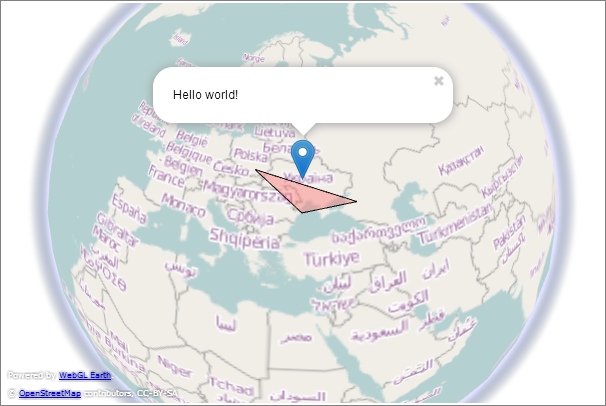

    Use WebGl Earth in your Flask application,
    ability to add markers and polygons

        ##Reuires
        - Jinja
        - Flask

        ##Installation
        '''pip install flask-webglearth'''

        or

        '''
        git clone https://github.com/nikulesko/Flask-WebGLEarth
        cd Flask-WebGLEarth
        python setup.py install
        ```

        ##View
        '''python
        from flask import Flask, render_template
        from flask_webglearth import WebGlEarth, WebGl, MAP_TYPES, Marker, Polygon

        app = Flask(__name__, template_folder=".")
        WebGl(app)


        @app.route("/")
        def index():
            webgl_earth = WebGlEarth(zoom=1, map_type=MAP_TYPES.get('osm'),
                                     center=[46.3, 30.4], atmosphere=True,
                                     markers=[Marker(49.3, 30.4, "Hello world!")],
                                     polygons=[Polygon(([45.1, 30.3],
                                                        [46.1, 40.56], [50.3, 20.8]))])
            return render_template('example_template.html', webgl_map=webgl_earth)


        if __name__ == "__main__":
            app.run(debug=True)
        '''

        ## Template
        '''html
        <!DOCTYPE html>
        <html>
        <head>
            <title></title>
            {{webgl_map.js}}
        </head>
        <body onload="initialize()">
        <div id="earth_div" style="width:600px;height:400px;border:1px solid gray; padding:2px;">
        </body>
        </html>
        '''

        ## Screenshot

        
